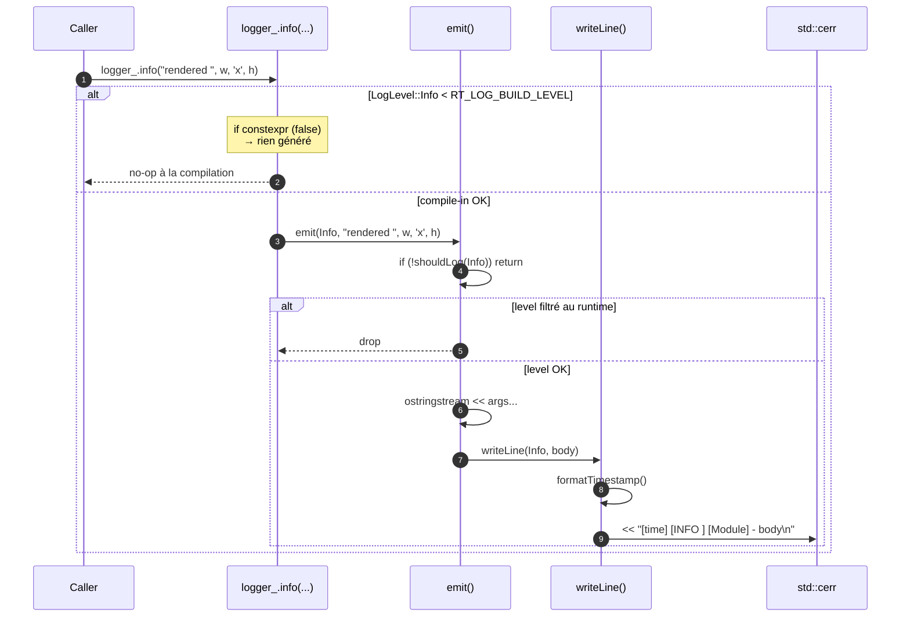

# Logger — `raytracer::common::Logger`

Logger structuré à la **Pino** (Node) / **NestJS**, vivant dans
`src/common/helper/` (lib `raytracer_helper`). Conçu comme une vraie
facility applicative : les logs sont **actifs en release**, c'est un
filtre — pas un `#ifdef NDEBUG` — qui décide ce qui sort.

---

## 1. Format de sortie

```
[HH:MM:SS.mmm] [LEVEL] [Module] - body
```

Exemple :

```
[20:21:35.159] [INFO ] [Renderer] - starting render 1920x1080, tiles 32x32, samples=4, maxDepth=10
[20:21:36.304] [INFO ] [Renderer] - render() took 1145.452 ms
```

Quand `stderr` est un TTY, chaque ligne est colorisée selon le niveau.

---

## 2. API — orientée instances

Chaque classe qui log **possède son `Logger`** et lui passe le nom du
module à la construction. Plus de logger statique appelé à la volée.

```cpp
#include "common/helper/Logger.hpp"

class RaytracerRenderer : public IRenderer {
 private:
    raytracer::common::Logger logger_{"Renderer"};

 public:
    components::Image render(...) {
        auto timer = logger_.scope("render()");
        logger_.info("starting render ", w, 'x', h,
                     ", samples=", samples);
        // …
        logger_.warn("no tiles produced");
        logger_.debug("ThreadPool spawned ", n, " worker(s)");
    }
};
```

Les méthodes acceptent **n'importe quel type streamable** sur
`std::ostream` :

```cpp
logger_.info("rendered ", width, 'x', height, " in ", ms, " ms");
```

`logger_.scope("label")` retourne un `ScopedTimer` RAII qui logge
`label took X.XXX ms` à la destruction (niveau `Info` par défaut).

---

## 3. Niveaux

| Niveau   | Valeur | Couleur ANSI | Quand l'utiliser                                    |
| -------- | ------ | ------------ | --------------------------------------------------- |
| `Trace`  | 0      | gris         | événements très fréquents (par tuile, par rayon)    |
| `Debug`  | 1      | cyan         | diagnostic dev (taille de pool, durées internes)    |
| `Info`   | 2      | vert         | événements significatifs (démarrage / fin de rendu) |
| `Warn`   | 3      | jaune        | situations anormales mais non bloquantes            |
| `Error`  | 4      | rouge        | échec récupérable                                   |
| `Silent` | 5      | —            | désactive tout                                      |

---

## 4. Deux couches de filtre

### 4.1 Compile-time (`LOG_LEVEL` CMake → `RT_LOG_BUILD_LEVEL`)

Chaque méthode est emballée dans un `if constexpr` :

```cpp
template <class... Args>
void debug(Args&&... args) const {
    if constexpr (isCompiledIn(LogLevel::Debug)) {
        emit(LogLevel::Debug, std::forward<Args>(args)...);
    }
}
```

→ si le niveau de la méthode est **strictement inférieur** à
`RT_LOG_BUILD_LEVEL`, le compilateur ne génère **aucun code** au call
site. Zéro instruction, zéro chaîne, zéro symbole.

**Configuration depuis CMake :**

```bash
cmake -B build                              # info en Release, trace ailleurs
cmake -B build -DLOG_LEVEL=info             # debug/trace rayés du binaire
cmake -B build -DLOG_LEVEL=silent           # tout est rayé, méthodes vides
cmake -B build -DLOG_LEVEL=trace            # tout est compilé
```

Valeurs acceptées (insensibles à la casse) :
`trace | debug | info | warn | warning | error | silent | off | none`.

**Défauts automatiques :**

```cmake
if(CMAKE_BUILD_TYPE STREQUAL "Release")
  set(LOG_LEVEL "info")    # binaire de prod : pas de debug
else()
  set(LOG_LEVEL "trace")   # dev : tout dispo, runtime décide
endif()
```

### 4.2 Runtime (`Logger::setLevel` / env `RT_LOG_LEVEL`)

Filtre classique appliqué à chaque appel **qui a survécu** au filtre
compile-time :

```bash
./raytracer scenes/foo.cfg                   # niveau par défaut : Info
RT_LOG_LEVEL=debug ./raytracer scenes/foo.cfg
RT_LOG_LEVEL=warn  ./raytracer scenes/foo.cfg
```

Ou programmatique :

```cpp
raytracer::common::Logger::setLevel(LogLevel::Warn);
```

**Défaut runtime : `Info`** — pas de bruit `Debug` même si tout est
compilé. Pour voir les debug, il faut explicitement `RT_LOG_LEVEL=debug`.

**Important :** baisser `RT_LOG_LEVEL` en dessous de `LOG_LEVEL`
compile-time **n'a aucun effet** — les appels concernés n'existent
pas dans le binaire.

---

## 5. Comment ça fonctionne (séquence)



Points-clés :

- **Verrou unique** sur `std::cerr` côté `writeLine()` : deux threads
  ne peuvent pas intercaler de caractères. Vérifié par
  `LoggerTest.IsThreadSafeAcrossConcurrentWrites`.
- **`ScopedTimer` mesure avec `steady_clock`** (insensible aux NTP
  jumps) ; le timestamp d'affichage utilise `system_clock` (wall-clock).
- **Move-only** : `Logger::scope("...")` retourne un `ScopedTimer`
  déplaçable mais non copiable. Une instance déplacée-de est silencieuse
  à la destruction (testé par `ScopedTimerMovedFromInstanceIsSilent`).

---

## 6. Choix techniques

### 6.1 Pourquoi des instances, pas un singleton statique ?

L'API précédente exposait `Logger::log("Renderer", "msg")` : nom de
module redondant à chaque appel, facile à oublier ou à mal orthographier.
L'instance porte le module **une seule fois**, à la construction :

```cpp
Logger logger_{"Renderer"};         // module fixé ici
logger_.info("foo");                // pas de string à passer
logger_.warn("bar");                // idem
```

Effet collatéral bénéfique : pour ajouter un logger à un nouveau module
on **déclare un membre**, on n'a pas à toucher d'API globale.

### 6.2 Pourquoi `if constexpr` plutôt que des macros ?

Le projet privilégie les fonctions aux macros (cf. règle R8). `if
constexpr` donne **exactement** la même garantie qu'un `#ifdef` côté
binaire : si la condition est fausse, le bloc ne génère aucune
instruction. Mais on garde la sécurité du typage, l'auto-complete, le
debugger qui voit la fonction, et la flexibilité (filtre **par niveau**,
pas un on/off binaire comme `NDEBUG`).

### 6.3 Pourquoi runtime par défaut `Info` ?

C'est le contrat du projet : une application normale affiche
`starting render`, `render() took 1.2s`, `no tiles produced` —
*pas* les détails internes. `Debug` reste opt-in via
`RT_LOG_LEVEL=debug`.

### 6.4 Pourquoi `std::cerr` plutôt que `std::cout` ?

Les logs sont du **diagnostic**, pas le produit principal du programme.
Le PPM va sur `stdout` (ou disque), les logs sur `stderr`. `stderr` est
non bufferisé → les messages apparaissent même en cas de crash.
`2> log.txt` permet d'archiver sans polluer la sortie utile.

### 6.5 Couleurs avec détection TTY

Décidée *une fois* au premier appel (`static const bool enabled`) :

- Respecte `NO_COLOR=1` ([no-color.org](https://no-color.org)).
- Respecte `RT_LOG_NO_COLOR=1` (préfixé projet).
- Quand redirigé vers un fichier ou pipe : pas de codes ANSI parasites.
- POSIX uniquement (`unistd.h`) — cible macOS/Linux.

---

## 7. Intégration CMake

Le bloc en tête de `CMakeLists.txt` traduit `LOG_LEVEL` (chaîne) en
`RT_LOG_BUILD_LEVEL` (entier 0..5) et l'injecte globalement :

```cmake
if(NOT DEFINED LOG_LEVEL)
  if(CMAKE_BUILD_TYPE STREQUAL "Release")
    set(LOG_LEVEL "info")
  else()
    set(LOG_LEVEL "trace")
  endif()
endif()

# … mapping name → 0..5 …

add_compile_definitions(RT_LOG_BUILD_LEVEL=${RT_LOG_BUILD_LEVEL})
```

`add_compile_definitions` propage la define à **tous** les targets de
l'arbre — pas besoin de la lier explicitement à `raytracer_helper`.

La lib `raytracer_helper` est **`STATIC`** (passée de `INTERFACE`
quand le Logger.cpp est arrivé). Tous les modules en aval
(`raytracer_renderer`, `raytracer_application`, tests) bénéficient
transitivement de la define.

---

## 8. Tests

`tests/common/helper/LoggerTest.cpp` (11 cas) :

- Format `[time] [LEVEL] [Module] - body` correct.
- Concaténation hétérogène (`int`, `char`, `double`, `string`).
- Filtre de niveau effectif (drop trace/debug/info quand level=Warn).
- `Silent` filtre tout, même `Error`.
- Le défaut runtime `Info` masque `debug`.
- `shouldLog` cohérent avec `setLevel`.
- `ScopedTimer` émet `<label> took X ms` à la destruction.
- `ScopedTimer` reste silencieux si le niveau est filtré.
- `ScopedTimer` déplacé-de n'émet pas (pas de double-log).
- Le contrat lazy/eager des arguments est documenté.
- Thread-safe : 4 threads × 50 messages → exactement 200 lignes
  `[Worker]` (chaque ligne intacte, pas d'intercalation).

```bash
cmake --build build -j --target raytracer_tests
./build/tests/raytracer_tests --gtest_filter='LoggerTest.*'
```

---

## 9. Évolutions possibles

| Idée                                       | Quand l'envisager                                                |
| ------------------------------------------ | ---------------------------------------------------------------- |
| Sortie JSON structurée (Pino-style strict) | Si on veut piper dans `pino-pretty` / `jq`.                       |
| Backend pluggable (file, syslog, ring buf) | Si le rendu devient un service long-running.                      |
| Per-module level                           | Quand on a 5+ modules et qu'on veut isoler le bruit.              |
| `std::format` au lieu de `ostringstream`   | Quand le compilateur cible le supporte solidement.                |
| Sampling sur logs très fréquents           | Si on ajoute du log par-rayon en `Trace` et qu'on veut limiter le débit. |

Aucune n'est nécessaire au MVP — documenté ici pour ne pas relancer
la discussion à zéro.
